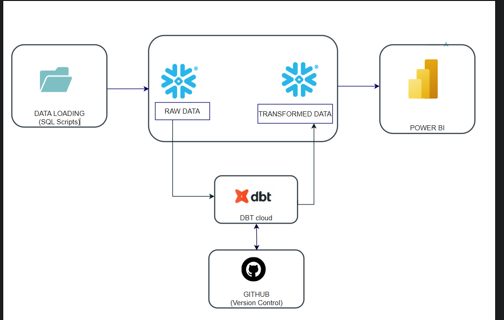
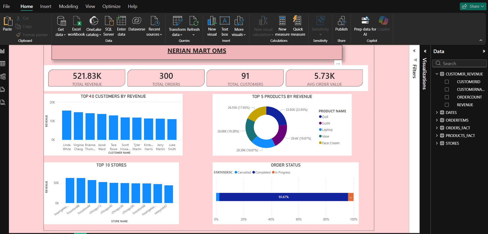

# NerianMart OMS – Snowflake + dbt Analytics Pipeline

End-to-end analytics project built on the NerianMart Order Management System (OMS) dataset.
Covers data loading, transformation with dbt, and reporting with Power BI.

## Architecture



## Dashboard



## dbt Lineage Graph

![dbt Lineage]04_ Assets/linear graph_productsfact.png

## Tools
- Snowflake (data warehouse)
- dbt Cloud (transformations & modelling)
- Power BI (reporting)
- GitHub (version control)

## Project Structure
\```
├── 01_snowflake_setup/    # SQL scripts to create DB, schema and load raw data
├── models/
│   └── customer_revenue/  # dbt staging, fact and mart models
├── 04_ Assets/                # Architecture diagram, dashboard and lineage screenshots
└── README.md
\```

## How to Reproduce

### Step 1 – Load Raw Data
Run scripts in `/01_snowflake_setup/` in order (01 → 09) directly in Snowflake

### Step 2 – Run dbt models
\```
dbt run
\```

### Step 3 – Connect Power BI
Connect Power BI directly to Snowflake and load the transformed tables

## Data Source
Raw data provided by [SleekData](https://www.youtube.com/@sleekdata) 
for educational purposes only.
